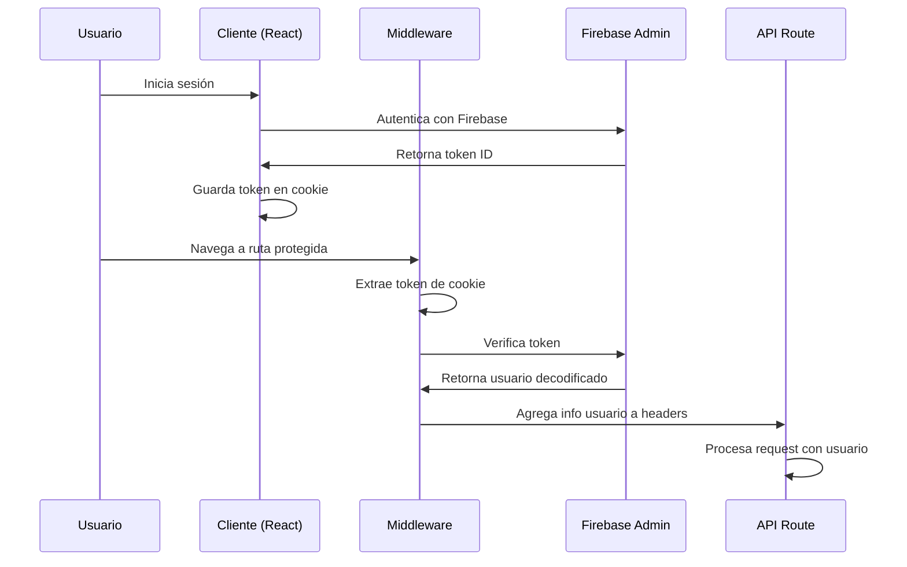

# Sistema de Middleware y Autenticación con Firebase

## Descripción General

Este proyecto implementa un sistema robusto de autenticación y autorización utilizando Firebase Authentication con tokens personalizados. El sistema incluye:

- **Middleware de Next.js** que verifica tokens de Firebase en cada request
- **Gestión automática de tokens** en cookies del navegador
- **Utilidades de autenticación** para API routes
- **Verificación de roles y permisos** a nivel de servidor
- **Información de usuario** disponible en headers para todas las rutas protegidas

## Arquitectura del Sistema

### 1. Flujo de Autenticación



### 2. Componentes del Sistema

#### Middleware (`src/middleware.ts`)
- **Función**: Intercepta todas las requests y verifica autenticación
- **Responsabilidades**:
  - Extraer tokens de cookies o headers Authorization
  - Verificar tokens con Firebase Admin SDK
  - Agregar información del usuario a headers
  - Redirigir a login si no está autenticado
  - Retornar errores 401/500 para API routes

#### Hook de Autenticación (`src/hooks/useAuth.tsx`)
- **Función**: Maneja el estado de autenticación en el cliente
- **Responsabilidades**:
  - Escuchar cambios de estado de Firebase Auth
  - Guardar/eliminar tokens en cookies automáticamente
  - Proporcionar métodos de login/logout
  - Manejar autenticación con Google

#### Utilidades de Autenticación (`src/lib/auth-utils.ts`)
- **Función**: Facilita el acceso a información de usuario en API routes
- **Responsabilidades**:
  - Extraer información de usuario desde headers
  - Verificar roles y permisos
  - Proporcionar middleware de autorización

## Configuración y Uso

### 1. Variables de Entorno Requeridas

```env
# Firebase Client (público)
NEXT_PUBLIC_FIREBASE_API_KEY=your_api_key
NEXT_PUBLIC_FIREBASE_AUTH_DOMAIN=your_project.firebaseapp.com
NEXT_PUBLIC_FIREBASE_PROJECT_ID=your_project_id
NEXT_PUBLIC_FIREBASE_STORAGE_BUCKET=your_project.appspot.com
NEXT_PUBLIC_FIREBASE_MESSAGING_SENDER_ID=your_sender_id
NEXT_PUBLIC_FIREBASE_APP_ID=your_app_id

# Firebase Admin (privado)
# Las credenciales se cargan desde el archivo JSON en src/lib/firebase/
```

### 2. Configuración de Firebase Console

1. **Habilitar Google Sign-In**:
   - Ve a Authentication > Sign-in method
   - Habilita "Google"
   - Configura el dominio autorizado

2. **Generar Credenciales de Admin**:
   - Ve a Project Settings > Service accounts
   - Genera nueva clave privada
   - Guarda el archivo JSON en el proyecto

### 3. Uso en Componentes React

```tsx
import { useAuth } from '@/hooks/useAuth';

function LoginComponent() {
  const { signIn, signInWithGoogle, user, loading, error } = useAuth();

  const handleEmailLogin = async (email: string, password: string) => {
    try {
      await signIn(email, password);
      // Usuario autenticado, token guardado automáticamente
    } catch (error) {
      // Manejar error
    }
  };

  const handleGoogleLogin = async () => {
    try {
      await signInWithGoogle();
      // Usuario autenticado con Google
    } catch (error) {
      // Manejar error
    }
  };

  return (
    // JSX del componente
  );
}
```

### 4. Uso en API Routes

#### API Route Básica

```typescript
import { NextRequest } from 'next/server';
import { getAuthenticatedUser } from '@/lib/auth-utils';

export async function GET(request: NextRequest) {
  // Obtener usuario autenticado
  const user = getAuthenticatedUser(request);
  
  if (!user) {
    return Response.json(
      { error: 'No autenticado' },
      { status: 401 }
    );
  }

  // Usar información del usuario
  console.log(`Usuario: ${user.email} (${user.uid})`);
  
  return Response.json({ user });
}
```

#### API Route con Verificación de Roles

```typescript
import { NextRequest } from 'next/server';
import { requireRole, getAuthenticatedUser } from '@/lib/auth-utils';

export async function POST(request: NextRequest) {
  // Verificar que el usuario sea administrador
  const roleCheck = requireRole('admin')(request);
  if (roleCheck) {
    return roleCheck; // Retorna error 403 si no tiene el rol
  }

  const user = getAuthenticatedUser(request);
  
  // Procesar operación administrativa
  return Response.json({ 
    message: 'Operación administrativa exitosa',
    performedBy: user?.email 
  });
}
```

## Información Disponible del Usuario

El middleware agrega los siguientes headers a cada request autenticada:

- `x-user-id`: UID del usuario en Firebase
- `x-user-email`: Email del usuario
- `x-user-name`: Nombre del usuario
- `x-user-verified`: Si el email está verificado ("true"/"false")
- `x-user-role`: Rol del usuario (si está configurado en custom claims)
- `x-user-organization`: ID de organización (si está configurado)

## Gestión de Tokens

### Almacenamiento
- Los tokens se guardan en cookies con nombre `firebaseToken`
- Configuración de cookie: `secure`, `samesite=strict`, `max-age=3600`
- Se actualizan automáticamente cuando el usuario se autentica
- Se eliminan automáticamente cuando el usuario cierra sesión

### Extracción
El middleware busca tokens en este orden:
1. Cookie `firebaseToken`
2. Header `Authorization: Bearer <token>`

### Verificación
- Usa Firebase Admin SDK para verificar tokens
- Valida firma, expiración y emisor
- Extrae claims personalizados del token

## Rutas y Configuración

### Rutas Públicas (No requieren autenticación)
- `/auth/login`
- `/auth/register`
- `/auth/reset-password`
- `/api/auth/verify`

### Rutas Protegidas
- Todas las demás rutas requieren autenticación
- Las rutas `/api/*` retornan errores JSON
- Las rutas de páginas redirigen a `/auth/login`

### Matcher del Middleware
El middleware se ejecuta en todas las rutas excepto:
- `/_next/*` (archivos estáticos de Next.js)
- `/favicon.ico`
- `/images/*`, `/fonts/*`, `/public/*`, `/assets/*`

## Manejo de Errores

### Códigos de Error
- `AUTH_TOKEN_MISSING`: No se proporcionó token
- `AUTH_TOKEN_INVALID`: Token inválido o expirado
- `AUTH_VERIFICATION_ERROR`: Error interno al verificar token
- `AUTH_REQUIRED`: Usuario no autenticado
- `INSUFFICIENT_PERMISSIONS`: Sin permisos suficientes
- `ORGANIZATION_ACCESS_DENIED`: Sin acceso a la organización

### Respuestas de Error

#### Para API Routes
```json
{
  "error": "Descripción del error",
  "code": "CODIGO_ERROR"
}
```

#### Para Páginas
- Redirección a `/auth/login?callbackUrl=<url_original>`
- Parámetros adicionales: `error=token_expired` o `error=auth_error`

## Seguridad

### Mejores Prácticas Implementadas
- Tokens con expiración automática (1 hora)
- Cookies seguras con flags apropiados
- Verificación server-side de todos los tokens
- No exposición de tokens en logs
- Validación de roles en el servidor
- Headers de usuario solo en requests autenticadas

### Consideraciones Adicionales
- Los tokens se renuevan automáticamente por Firebase
- El middleware maneja errores de red y Firebase gracefully
- Los custom claims se pueden usar para roles y organizaciones
- Compatible con Firebase Emulator para desarrollo

## Ejemplos de Uso

Ver los archivos de ejemplo:
- `src/app/api/user/profile/route.ts` - API básica con autenticación
- `src/app/api/admin/users/route.ts` - API con verificación de roles
- `src/components/auth/login-form.tsx` - Componente de login con Google

## Troubleshooting

### Problemas Comunes

1. **Error "auth/api-key-not-valid"**
   - Verificar variables de entorno `NEXT_PUBLIC_FIREBASE_*`
   - Confirmar configuración en Firebase Console

2. **Token no se guarda en cookie**
   - Verificar que el dominio sea HTTPS en producción
   - Revisar configuración de cookies en el navegador

3. **Middleware no funciona**
   - Verificar que el archivo `middleware.ts` esté en `src/`
   - Confirmar que el matcher incluya las rutas correctas

4. **Firebase Admin no inicializa**
   - Verificar que el archivo JSON de credenciales exista
   - Confirmar que las credenciales sean válidas
   - Revisar logs del servidor para errores específicos