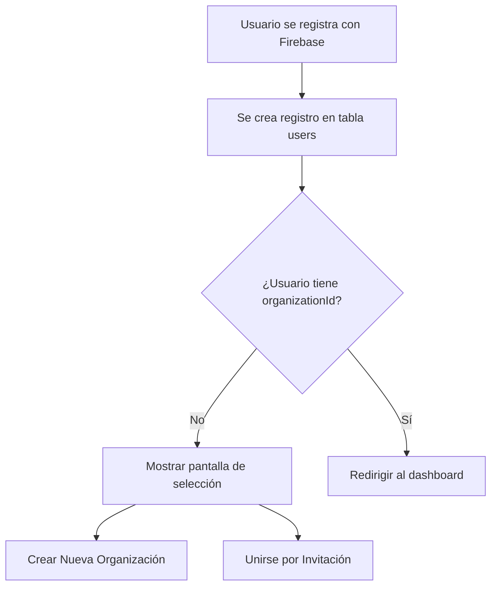

# Flujo de Registro y Asignación de Organizaciones

## Resumen del Sistema

Este documento describe el flujo completo para el manejo de usuarios y organizaciones en el sistema Delivery Tracker App, incluyendo registro, creación de organizaciones, invitaciones y casos edge.

## Arquitectura de Base de Datos

### Tablas Principales

1. **`users`** - Información de usuarios con Firebase Auth
2. **`organizations`** - Datos de las organizaciones
3. **`organization_invitations`** - Sistema de invitaciones por email
4. **`organization_requests`** - Solicitudes de creación de organizaciones

### Relaciones Clave

- Un usuario puede pertenecer a **una sola organización** (`users.organizationId`)
- Un usuario puede **crear múltiples organizaciones** (`organizations.createdBy`)
- Un usuario puede **enviar/recibir múltiples invitaciones**
- Un usuario puede **hacer múltiples solicitudes** de creación

## Flujo Principal de Registro

### 1. Registro Inicial del Usuario



**Campos iniciales del usuario:**
```typescript
{
  firebaseUid: string,
  email: string,
  emailVerified: boolean,
  displayName: string,
  role: 'N/A', // Por defecto hasta asignar organización
  organizationId: null, // Inicialmente null
  isActive: true
}
```

### 2. Opciones Post-Registro

Cuando un usuario se registra y no tiene `organizationId`, se presenta con dos opciones:

#### Opción A: Crear Nueva Organización
#### Opción B: Unirse por Invitación

## Flujo A: Creación de Nueva Organización

### Proceso de Solicitud

1. **Usuario llena formulario de solicitud:**
   ```typescript
   {
     organizationName: string,
     organizationNit?: number,
     organizationPhone?: string,
     organizationAddress?: string,
     organizationRegimen?: 'Regimen simplificado' | 'Regimen común',
     businessJustification: string, // Requerido
     contactName: string,
     contactPosition?: string,
     contactPhone?: string,
     priority: 'medium' // Por defecto
   }
   ```

2. **Se crea registro en `organization_requests`:**
   ```typescript
   {
     requestedBy: userId,
     status: 'pending',
     // ... datos del formulario
     createdAt: now()
   }
   ```

3. **Estados posibles de la solicitud:**
   - `pending` - Recién creada
   - `under_review` - En revisión por admin
   - `approved` - Aprobada
   - `rejected` - Rechazada
   - `cancelled` - Cancelada por el usuario

### Proceso de Aprobación

1. **Administrador del sistema revisa solicitud**
2. **Si se aprueba:**
   ```typescript
   // 1. Crear organización
   const org = await createOrganization({
     name: request.organizationName,
     nit: request.organizationNit,
     // ... otros campos
     createdBy: request.requestedBy,
     isActive: true
   });
   
   // 2. Actualizar usuario
   await updateUser(request.requestedBy, {
     organizationId: org.id,
     role: 'admin' // Creador se convierte en admin
   });
   
   // 3. Actualizar solicitud
   await updateRequest(request.id, {
     status: 'approved',
     reviewedBy: adminId,
     reviewedAt: now(),
     createdOrganizationId: org.id
   });
   ```

3. **Si se rechaza:**
   ```typescript
   await updateRequest(request.id, {
     status: 'rejected',
     reviewedBy: adminId,
     reviewedAt: now(),
     reviewComments: 'Razón del rechazo'
   });
   ```

## Flujo B: Unirse por Invitación

### Proceso de Invitación

1. **Usuario con organización envía invitación:**
   ```typescript
   {
     organizationId: inviter.organizationId,
     invitedEmail: 'nuevo@usuario.com',
     invitedBy: inviter.id,
     invitationToken: generateUUID(),
     assignedRole: 'service_client' | 'delivery' | 'admin',
     expiresAt: addDays(now(), 7), // 7 días por defecto
     status: 'pending',
     message?: 'Mensaje personalizado'
   }
   ```

2. **Se envía email con link de invitación:**
   ```
   https://app.delivery-tracker.com/invite/{invitationToken}
   ```

### Proceso de Aceptación

1. **Usuario hace clic en link de invitación**
2. **Sistema valida token:**
   ```typescript
   const invitation = await getInvitationByToken(token);
   
   // Validaciones
   if (!invitation) throw new Error('Invitación no encontrada');
   if (invitation.status !== 'pending') throw new Error('Invitación ya procesada');
   if (invitation.expiresAt < now()) throw new Error('Invitación expirada');
   ```

3. **Si usuario no está registrado:**
   - Redirigir a registro con token en query params
   - Después del registro, procesar invitación automáticamente

4. **Si usuario ya está registrado:**
   ```typescript
   // Verificar que el email coincida
   if (user.email !== invitation.invitedEmail) {
     throw new Error('Email no coincide con la invitación');
   }
   
   // Verificar que no tenga organización
   if (user.organizationId) {
     throw new Error('Usuario ya pertenece a una organización');
   }
   
   // Procesar aceptación
   await acceptInvitation(invitation.id, user.id);
   ```

5. **Procesar aceptación:**
   ```typescript
   async function acceptInvitation(invitationId: number, userId: number) {
     await db.transaction(async (tx) => {
       // Actualizar usuario
       await tx.update(users)
         .set({
           organizationId: invitation.organizationId,
           role: invitation.assignedRole
         })
         .where(eq(users.id, userId));
       
       // Actualizar invitación
       await tx.update(organizationInvitations)
         .set({
           status: 'accepted',
           acceptedBy: userId,
           acceptedAt: now()
         })
         .where(eq(organizationInvitations.id, invitationId));
     });
   }
   ```

## Casos Edge y Validaciones

### 1. Usuario ya tiene Organización

```typescript
if (user.organizationId) {
  // Mostrar mensaje: "Ya perteneces a una organización"
  // Opción: "Cambiar de organización" (requiere proceso especial)
  return;
}
```

### 2. Email de Invitación no Coincide

```typescript
if (user.email !== invitation.invitedEmail) {
  // Permitir al usuario solicitar cambio de email en la invitación
  // O rechazar y pedir nueva invitación
  throw new Error('El email no coincide con la invitación');
}
```

### 3. Invitación Expirada

```typescript
if (invitation.expiresAt < now()) {
  // Opción 1: Permitir renovar invitación
  // Opción 2: Crear nueva invitación
  throw new Error('La invitación ha expirado');
}
```

### 4. Múltiples Invitaciones Pendientes

```typescript
const pendingInvitations = await getUserPendingInvitations(userEmail);

if (pendingInvitations.length > 1) {
  // Mostrar lista de invitaciones pendientes
  // Usuario puede elegir cuál aceptar
  // Las demás se marcan como 'rejected' automáticamente
}
```

### 5. Usuario Intenta Crear Múltiples Organizaciones

```typescript
const existingRequests = await getUserPendingRequests(userId);

if (existingRequests.length > 0) {
  throw new Error('Ya tienes una solicitud pendiente');
}

if (user.organizationId) {
  throw new Error('Ya perteneces a una organización');
}
```

### 6. Organización Inactiva

```typescript
if (!organization.isActive) {
  // No permitir nuevas invitaciones
  // Mostrar mensaje a usuarios existentes
  throw new Error('La organización está inactiva');
}
```

## API Endpoints Necesarios

### Autenticación y Usuario
```typescript
POST /api/auth/register
GET  /api/user/profile
PUT  /api/user/profile
GET  /api/user/organization-status
```

### Organizaciones
```typescript
POST /api/organizations/request        // Solicitar crear organización
GET  /api/organizations/my-requests     // Ver mis solicitudes
PUT  /api/organizations/requests/:id    // Cancelar solicitud

// Solo admins
GET  /api/admin/organization-requests   // Ver todas las solicitudes
PUT  /api/admin/organization-requests/:id/approve
PUT  /api/admin/organization-requests/:id/reject
```

### Invitaciones
```typescript
POST /api/invitations/send             // Enviar invitación
GET  /api/invitations/sent             // Ver invitaciones enviadas
GET  /api/invitations/received         // Ver invitaciones recibidas
PUT  /api/invitations/:token/accept    // Aceptar invitación
PUT  /api/invitations/:token/reject    // Rechazar invitación
GET  /api/invitations/:token/validate  // Validar token de invitación
```

## Flujo de UI/UX

### 1. Pantalla Post-Registro
```
┌─────────────────────────────────────┐
│  ¡Bienvenido a Delivery Tracker!   │
│                                     │
│  Para continuar, necesitas:         │
│                                     │
│  ┌─────────────────────────────────┐ │
│  │  🏢 Crear Nueva Organización   │ │
│  │     Solicita crear tu empresa   │ │
│  └─────────────────────────────────┘ │
│                                     │
│  ┌─────────────────────────────────┐ │
│  │  📧 Unirse por Invitación      │ │
│  │     ¿Tienes un código?          │ │
│  └─────────────────────────────────┘ │
└─────────────────────────────────────┘
```

### 2. Estados de Solicitud
```
┌─────────────────────────────────────┐
│  Estado de tu Solicitud             │
│                                     │
│  🟡 Pendiente de Revisión           │
│     Enviada el 15/01/2024           │
│                                     │
│  📋 Detalles:                       │
│     Empresa: Mi Delivery SAS        │
│     NIT: 123456789                  │
│                                     │
│  [Cancelar Solicitud]               │
└─────────────────────────────────────┘
```

## Consideraciones de Seguridad

### 1. Validación de Tokens
- Tokens de invitación deben ser UUID v4
- Expiración obligatoria (máximo 30 días)
- Un solo uso por token

### 2. Validación de Emails
- Email debe estar verificado en Firebase
- Coincidencia exacta con invitación
- Prevenir ataques de enumeración

### 3. Permisos
- Solo admins pueden aprobar solicitudes
- Solo miembros pueden enviar invitaciones
- Validar permisos en cada endpoint

### 4. Rate Limiting
- Máximo 5 solicitudes de organización por usuario
- Máximo 10 invitaciones por día por usuario
- Cooldown de 1 hora entre solicitudes

## Métricas y Monitoreo

### KPIs a Trackear
- Tiempo promedio de aprobación de solicitudes
- Tasa de aceptación de invitaciones
- Organizaciones activas vs inactivas
- Usuarios sin organización (conversión)

### Logs Importantes
- Creación de solicitudes
- Aprobación/rechazo de solicitudes
- Envío y aceptación de invitaciones
- Errores de validación

## Migración de Datos Existentes

Si ya existen usuarios y organizaciones:

```sql
-- Asignar usuarios existentes como creadores de sus organizaciones
UPDATE organizations o
SET created_by = (
  SELECT u.id 
  FROM users u 
  WHERE u.organization_id = o.id 
    AND u.role = 'admin' 
  LIMIT 1
)
WHERE o.created_by IS NULL;

-- Activar todas las organizaciones existentes
UPDATE organizations 
SET is_active = true, 
    allow_invitations = true,
    require_approval_for_join = false
WHERE is_active IS NULL;
```

Este flujo garantiza un sistema robusto y escalable para el manejo de organizaciones y usuarios, cubriendo todos los casos edge identificados y proporcionando una experiencia de usuario fluida.